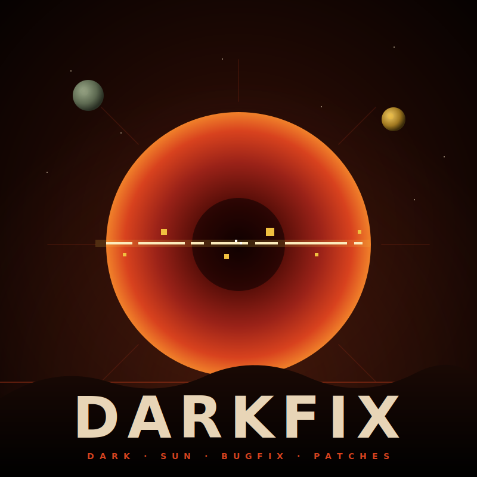

  

# OpenDS

**An open community toolkit for SSI's Dark Sun CRPGs** —
*Shattered Lands* (1993) and *Wake of the Ravager* (1994).

Tools, patches, and documentation. Everything we learn gets
written down. Every utility we build gets published.

## What ships out of this repo

In build order — **tools first, patches second**:

- **Tools** — every utility built to make the digging easier.
  Twelve ship today, each independently with its own README,
  `VERSION`, and tagged release. MIT-licensed. → [`tools/`](tools/)

  | Tool | What it does |
  |---|---|
  | [`opends`](tools/opends/) | Umbrella CLI: "I have this file, what is it?" Dispatches by magic to the right tool. |
  | [`gff-edit`](tools/gff-edit/) | GFF container read/write library + `gff-cat` CLI. The foundation everything else builds on. |
  | [`gpl-disasm`](tools/gpl-disasm/) | GPL bytecode disassembler: text or JSON, CFG labels, curated symbol names. |
  | [`gpl-asm`](tools/gpl-asm/) | GPL reassembler and patch authoring: 600/600 corpus chunks round-trip byte-identical. |
  | [`save-inspect`](tools/save-inspect/) | Save-file inspector and editor: dump, diff, edit PCs and items, write back safely. |
  | [`dialog-extract`](tools/dialog-extract/) | Pull NPC dialog out of GPL chunks as JSON, transcript, or browsable HTML. |
  | [`image-extract`](tools/image-extract/) | Decode bitmap chunks to PNG and pack edited PNGs back (sprite modding). |
  | [`region-render`](tools/region-render/) | Composite a region's tiles, walls, and entities into a map PNG or animated GIF. |
  | [`atlas`](tools/atlas/) | Static-HTML site generator: browse a whole install's sprites, maps, and dialog offline. |
  | [`verify-install`](tools/verify-install/) | Check an install against canonical hashes; repair from the GOG installer; roll back. |
  | [`repro`](tools/repro/) | DOSBox repro harness with overlay mounts (the install is never written), input automation, video capture. |
  | [`opcode-fuzz`](tools/opcode-fuzz/) | GPL opcode-discovery harness: swap a chunk, run the game, diff the world state. |

  The [`tools/README.md`](tools/README.md) table carries current
  versions and per-tool detail.
- **darkfix patches** — community bugfix patches for both
  games. Distributed as zips you apply to your GOG install. The
  game still launches via DOSBox; the bugs you used to hit, you
  don't. Authoring is built on the tools above.
  → [`ds1-patch/`](ds1-patch/), [`ds2-patch/`](ds2-patch/)
- **Documentation** — file formats, engine internals, bug
  catalogs, reverse-engineering notes. So the next person doesn't
  have to figure it out again. → [`docs/`](docs/)

Anything that makes the digging easier is priority #1. Patches
follow the toolkit. See [`roadmap.md`](roadmap.md) for the
phased ordering.

## What this is not (yet)

A full open-source engine reimplementation.

It has been tried, repeatedly. Public attempts going back two
decades:

- **Dark Sun World** (2004–2008) — DSO revival. Inactive.
- **A 2010s DSO emulator** — shut down by Wizards of the Coast.
- **paulofthewest's `soloscuro-archive`** — the most serious
  attempt, ~567 commits, stalled in 2023.
- **soloscuro (Zig rewrite)**, **soloscuro-orx**,
  **soloscuro-oldgo**, **libsoloscuro** — half a dozen prototypes
  inside the dsoageofheroes org alone, none playable end-to-end.
- **Beamdog forums port** — a community attempt to recreate
  *Shattered Lands* inside the Infinity Engine. Inactive.

Every attempt has stalled before delivering a playable game. The
problem is the GPL bytecode VM — the engine's embedded scripting
language, with no public spec — and the volume of game logic
expressed in it.

OpenDS goes at it sideways: ship the artifacts you build *on the
way* to an engine — disassemblers, chunk editors, format docs, bug
patches — as standalone, useful tools. Each one is valuable on
its own. Each one teaches us more about the engine. The eventual
full reimplementation lives in the project's name as an
aspiration, not a roadmap commitment. We get there if we get
there. The toolkit and patches matter even if we don't.

## Status

The toolkit is read-complete and write-capable: every shipped
file format can be inspected, and GFF chunks, GPL bytecode,
sprites, and saves can all be edited and written back with
round-trip verification. Roadmap Phases 0-5 (documentation,
GFF foundation, repro harness, disassembler, exploration tools,
assembler) have substantially shipped. The current front is
Phase 6: author, package, and ship the first darkfix patch.

- [`spec.md`](spec.md) — design spec and invariants
- [`roadmap.md`](roadmap.md) — phased plan and current status
- [`docs/README.md`](docs/README.md) — documentation index with
  reading paths (modder, engine researcher, patch author,
  contributor)

## Quick start (developer)

You need a legitimate copy of one or both games (GOG installers
recommended). Place the GOG `.exe` installers under `.games/`
(gitignored) and extract with `innoextract`; see
[`docs/build-environment.md`](docs/build-environment.md) for the
walkthrough. `verify-install --repair` can also extract single
files from the installer to heal a damaged install.

## License

TBD — likely MIT for tools and patch tooling. Game data files
are not redistributed; they remain the property of Wizards of
the Coast / the original copyright holders. The player provides
their own.

## Credits

Standing on the shoulders of every prior attempt:

- **paulofthewest** and the [dsoageofheroes](https://github.com/dsoageofheroes)
  organization (`libgff`, `soloscuro-archive`, `libsoloscuro`, and
  family) — the deepest public GFF and GPL reverse-engineering
  work. The GFF on-disk layout, the 129-entry GPL opcode
  catalogue, the GPL_* constants, and the 7-bit packed inline
  string decoder all came from these projects. OpenDS would
  not be feasible without them.
- **John Glassmyer** ([dsun_music](https://github.com/JohnGlassmyer/dsun_music))
  — the GFF *writer* policy (in-place if it fits, append
  otherwise) and the GFFI segmented-chunk cross-reference
  layout (`SecondaryGffiTable`) come from `GffFile.java`.
- **Greg Kennedy** ([DarkSunOnline](https://github.com/greg-kennedy/DarkSunOnline))
  — DSO protocol RE; the v1.0 client's debug symbols
  cross-reference WotR engine internals. Future reference for
  symbol curation in `gpl-disasm`.

[`CREDITS.md`](CREDITS.md) is the per-feature attribution
manifest: it maps each OpenDS feature to the specific upstream
file or function it was ported from.
[`docs/upstream-projects.md`](docs/upstream-projects.md) is the
broader catalogue of every upstream project we read or might
read. If you've worked on Dark Sun reverse-engineering and
aren't listed, open an issue — we'd rather over-credit than
under-credit.
