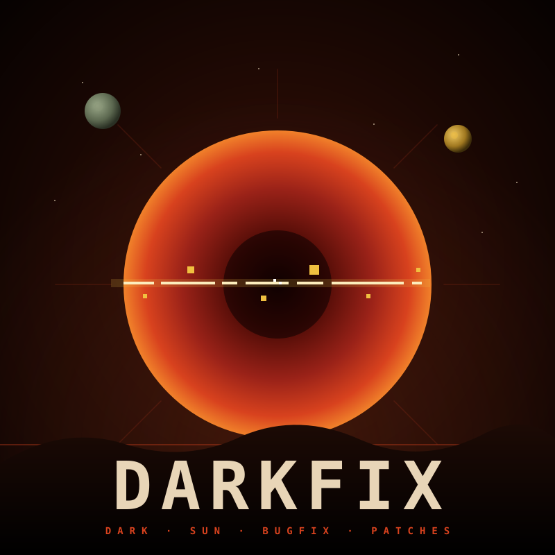

<p align="center">
  
</p>

# OpenDS

[](https://github.com/VirInvictus/opends/actions/workflows/ci.yml)

**An open community toolkit for SSI's Dark Sun CRPGs**:
*Shattered Lands* (1993) and *Wake of the Ravager* (1994).

Tools, patches, and documentation. Everything we learn gets
written down. Every utility we build gets published.

## What ships out of this repo

In build order: **tools first, patches second**:

- **Tools**: every utility built to make the digging easier.
  Fourteen ship today, each independently with its own README
  and `VERSION`. MIT-licensed. → [`tools/`](tools/)

  | Tool | What it does |
  |---|---|
  | [`opends`](tools/opends/) | Umbrella CLI: "I have this file, what is it?" Dispatches by magic to the right tool. |
  | [`gff-edit`](tools/gff-edit/) | GFF container read/write library + `gff-cat` CLI. The foundation everything else builds on. |
  | [`gpl-disasm`](tools/gpl-disasm/) | GPL bytecode disassembler: text or JSON, CFG labels, curated symbol names. |
  | [`gpl-asm`](tools/gpl-asm/) | GPL reassembler and patch authoring: 600/600 corpus chunks round-trip byte-identical. |
  | [`save-inspect`](tools/save-inspect/) | Save-file inspector and editor: dump, diff, edit PCs and items, write back safely. |
  | [`dialog-extract`](tools/dialog-extract/) | Pull NPC dialog out of GPL chunks as JSON, transcript, or browsable HTML. |
  | [`image-extract`](tools/image-extract/) | Decode bitmap chunks to PNG and pack edited PNGs back (sprite modding). |
  | [`region-render`](tools/region-render/) | Composite a region's tiles, walls, and entities into a map PNG or animated GIF. |
  | [`atlas`](tools/atlas/) | Static-HTML site generator: browse a whole install's sprites, maps, and dialog offline. |
  | [`verify-install`](tools/verify-install/) | Check an install against canonical hashes; repair from the GOG installer; roll back. |
  | [`repro`](tools/repro/) | DOSBox repro harness with overlay mounts (the install is never written), input automation, video capture. |
  | [`opcode-fuzz`](tools/opcode-fuzz/) | GPL opcode-discovery harness: swap a chunk, run the game, diff the world state. |
  | [`ovr-map`](tools/ovr-map/) | Map `DSUN.EXE`'s Borland overlay structure: segments, entry stubs, 16-bit disassembly, curated symbols, Ghidra bridge. |
  | [`exe-patch`](tools/exe-patch/) | Author, verify, and apply in-place byte patches to `DSUN.EXE`: `ovr:`/symbol addressing, mandatory fingerprints, hard refusals for anything the overlay format cannot survive. |

  The [`tools/README.md`](tools/README.md) table carries current
  versions and per-tool detail.
- **darkfix patches**: community bugfix patches for both
  games. Distributed as zips you apply to your GOG install. The
  game still launches via DOSBox; the bugs you used to hit, you
  don't. Authoring is built on the tools above.
  → [`ds1-patch/`](ds1-patch/), [`ds2-patch/`](ds2-patch/)
- **Documentation**: file formats, engine internals, bug
  catalogs, reverse-engineering notes, and the complete mined
  game data: every creature's stats, every item, spell, chest,
  inventory, map placement, and dialog line, published as
  regenerable catalogues. So the next person doesn't have to
  figure it out again. → [`docs/`](docs/)

Anything that makes the digging easier is priority #1. Patches
follow the toolkit. See [`roadmap.md`](roadmap.md) for the
phased ordering.

## What this is not (yet)

A full open-source engine reimplementation.

It has been tried, repeatedly. Public attempts going back two
decades:

- **Dark Sun World** (2004–2008): DSO revival. Inactive.
- **A 2010s DSO emulator**: shut down by Wizards of the Coast.
- **paulofthewest's `soloscuro-archive`**: the most serious
  attempt, ~567 commits, stalled in 2023.
- **soloscuro (Zig rewrite)**, **soloscuro-orx**,
  **soloscuro-oldgo**, **libsoloscuro**: half a dozen prototypes
  inside the dsoageofheroes org alone, none playable end-to-end.
- **Beamdog forums port**: a community attempt to recreate
  *Shattered Lands* inside the Infinity Engine. Inactive.

Every attempt has stalled before delivering a playable game. The
blocker was the GPL bytecode VM: the engine's embedded scripting
language, with no public spec, and most of the game's logic
written in it.

That spec now exists, here.
[`docs/gpl-vm.md`](docs/gpl-vm.md) documents the VM end to end
(both games ship one engine; the interpreter loop, the variable
model, and every opcode family, read out of the binaries), and
the catalogues under [`docs/`](docs/) carry the complete game
data it operates on. What still separates this repo from a
playable engine is not knowledge of the data: it is the runtime
behavior only a live engine can reveal (combat timing, the
scheduler) and the work of building the thing.

OpenDS goes at it sideways: ship the artifacts you build *on the
way* to an engine (disassemblers, chunk editors, format docs, bug
patches, data catalogues) as standalone, useful tools. Each one
is valuable on its own. Each one teaches us more about the
engine. The eventual full reimplementation lives in the project's
name as an aspiration, not a roadmap commitment. We get there if
we get there. The toolkit and patches matter even if we don't.

## Status

The toolkit is read-complete and write-capable: every shipped
file format can be inspected, and GFF chunks, GPL bytecode,
sprites, saves, and `DSUN.EXE` bytes can all be edited and
written back with verification. Roadmap Phases 0-5.7 have
shipped: the toolkit phases (documentation, GFF foundation,
repro harness, disassembler, exploration tools, assembler, the
overlay map, the naming campaign, the bug-site census, and the
EXE patch authoring surface). The patches have shipped too:
darkfix-ds1 0.1.0 (`fix.ds1.deadtriggers`, the Darkhold
dead-trigger family) and darkfix-ds2 0.1.0 (`fix.ds2.deadtriggers`,
27 dead registrations across Wake of the Ravager's story
regions), each with its repro fixture and differential capture.
Phase 7 is the DS2 mines-elevator fix, one runtime capture from a
complete site report.

The game data itself is documented end to end: machine-generated
catalogues under `docs/` cover every creature record (290 in
*Shattered Lands*, 352 in *Wake of the Ravager*), every item and
spell, every chest's contents, every creature inventory, every
map placement (13,028 + 13,559 across all 53 regions), and the
dialog corpus (46,000+ strings). Each catalogue is regenerated
from the shipped files by
[`extract-catalogue.py`](tools/gff-edit/scripts/extract-catalogue.py)
and gated on known-value checks (a named monster's stats, a known
chest, the elevator's sprite), so the numbers are verified, not
transcribed. The format references
([`object-formats.md`](docs/object-formats.md),
[`region-formats.md`](docs/region-formats.md),
[`presentation-formats.md`](docs/presentation-formats.md),
[`dialogs.md`](docs/dialogs.md)) document how it all fits
together: the substrate a total conversion or engine project
would build on.

- [`spec.md`](spec.md): design spec and invariants
- [`roadmap.md`](roadmap.md): phased plan and current status
- [`CONTRIBUTING.md`](CONTRIBUTING.md): how to contribute, the
  short version
- [`docs/README.md`](docs/README.md): documentation index with
  reading paths (modder, engine researcher, patch author,
  contributor); the [`cookbook`](docs/cookbook/) holds the worked
  authoring sessions

## Quick start (developer)

You need a legitimate copy of one or both games (GOG installers
recommended). Place the GOG `.exe` installers under `.games/`
(gitignored) and extract with `innoextract`; see
[`docs/build-environment.md`](docs/build-environment.md) for the
walkthrough. `verify-install --repair` can also extract single
files from the installer to heal a damaged install.

## License

The tools and patch tooling are MIT-licensed; see [`LICENSE`](LICENSE).
Game data files are not redistributed; they remain the property of
Wizards of the Coast / the original copyright holders. The player
provides their own.

## Credits

Standing on the shoulders of every prior attempt:

- **paulofthewest** and the [dsoageofheroes](https://github.com/dsoageofheroes)
  organization (`libgff`, `soloscuro-archive`, `libsoloscuro`, and
  family): the deepest public GFF and GPL reverse-engineering
  work. The GFF on-disk layout, the 129-entry GPL opcode
  catalogue, the GPL_* constants, and the 7-bit packed inline
  string decoder all came from these projects. OpenDS would
  not be feasible without them.
- **John Glassmyer**
  ([dsun_music](https://github.com/JohnGlassmyer/dsun_music)): the
  GFF *writer* policy (in-place if it fits, append otherwise) and
  the GFFI segmented-chunk cross-reference layout
  (`SecondaryGffiTable`) come from `GffFile.java`; the PLAN frame
  decoder and the big-endian bit chomper behind PLNR from
  `ImageReading.java` / `BitChomper.java`; region-render's
  geometry and entity placement from `RegionTool.java`.
- **Greg Kennedy**
  ([DarkSunOnline](https://github.com/greg-kennedy/DarkSunOnline)):
  DSO protocol RE; the v1.0 client's debug symbols cross-reference
  WotR engine internals. Future reference for symbol curation in
  `gpl-disasm`.

[`CREDITS.md`](CREDITS.md) is the per-feature attribution
manifest: it maps each OpenDS feature to the specific upstream
file or function it was ported from.
[`docs/upstream-projects.md`](docs/upstream-projects.md) is the
broader catalogue of every upstream project we read or might
read. If you've worked on Dark Sun reverse-engineering and
aren't listed, open an issue: we'd rather over-credit than
under-credit.

## Support

If OpenDS is useful to you and you'd like to chip in:

- liberapay · [liberapay.com/bdkl](https://liberapay.com/bdkl/)
- bitcoin
  ```
  bc1qkge6zr45tzqfwfmvma2ylumt6mg7wlwmhr05yv
  ```
